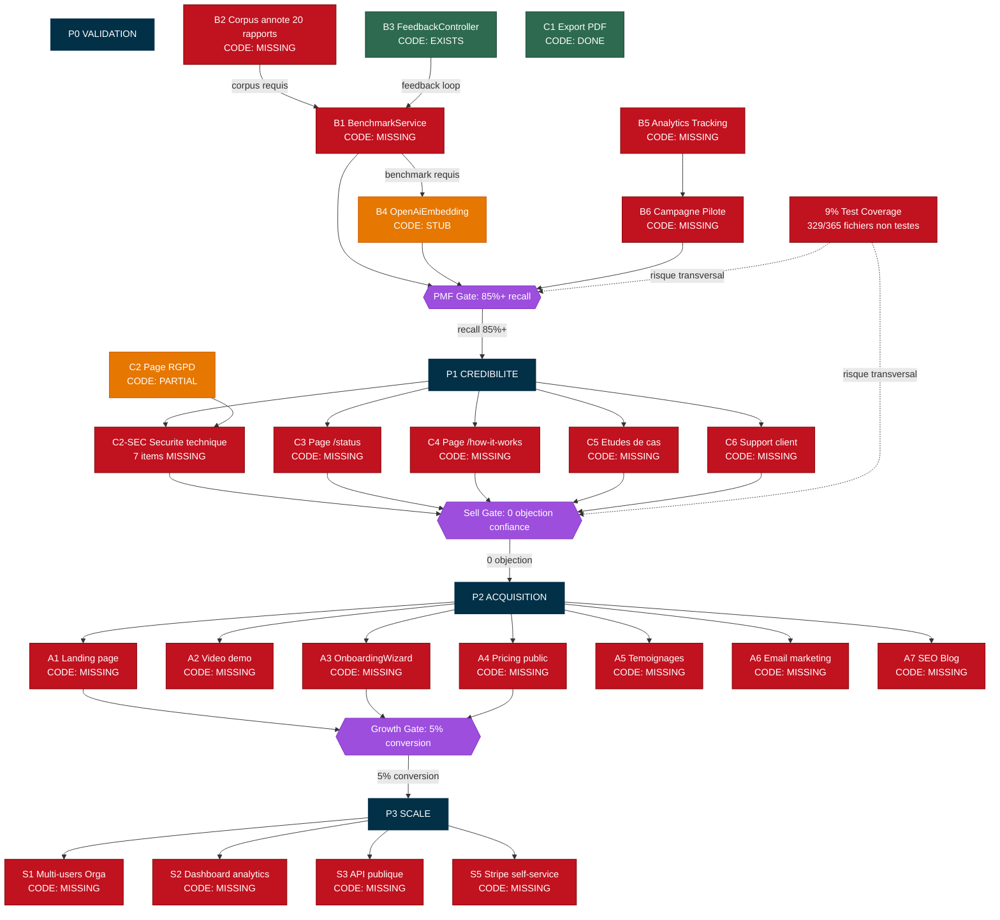

# Roadmap Déterministe ImpactDroit — État Code Réel

> Généré par analyse stigmergique du code source (pas des docs)
> Date : Analyse complète des 4 repos workspace

---

## Légende

- 🟢 **EXISTS** — Le code existe et fonctionne
- 🟠 **PARTIAL/STUB** — Le code existe mais incomplet
- 🔴 **MISSING** — Aucun code trouvé dans la codebase
- 🟣 **GATE** — Critère de passage obligatoire

---

## 1. Graphe de Dépendances Services

```mermaid
flowchart TB
    classDef exists fill:#2d6a4f,stroke:#1b4332,color:#fff
    classDef partial fill:#e67700,stroke:#cc5500,color:#fff
    classDef missing fill:#c1121f,stroke:#780000,color:#fff
    classDef infra fill:#343a40,stroke:#212529,color:#fff
    classDef external fill:#6c757d,stroke:#495057,color:#fff

    subgraph FRONTEND["FRONTEND — Next.js 14 / Vercel"]
        direction TB
        FE_AUTH0["Auth0 SSO"]:::exists
        FE_STRIPE["Stripe Paywall"]:::exists
        FE_UPLOAD["Upload Drag-Drop"]:::exists
        FE_GRID["Grille Detection"]:::exists
        FE_SSE["SSE Streaming"]:::exists
        FE_FEEDBACK["Feedback UI"]:::exists
        FE_EXPORT["Export PDF"]:::exists
        FE_RGPD["Page RGPD"]:::partial
        FE_LANDING["Landing Sales"]:::missing
        FE_ONBOARD["Onboarding Wizard"]:::missing
        FE_PRICING["Page /pricing"]:::missing
        FE_HOWIT["Page /how-it-works"]:::missing
        FE_STATUS["Page /status"]:::missing
        FE_TRACKING["Analytics Tracking"]:::missing
    end

    subgraph BACKEND["BACKEND — Spring Boot 3 / Java 21"]
        direction TB
        BE_API["REST API 20+ endpoints"]:::exists
        BE_PIPELINE["Pipeline SSE 8 etapes"]:::exists
        BE_DETECT["Detection 9 types fautes"]:::exists
        BE_JURIS["Recherche Jurisp BM25"]:::exists
        BE_UPLOAD_B["Upload PDFBox+POI"]:::exists
        BE_FEEDBACK_B["FeedbackController"]:::exists
        BE_EMBED["OpenAiEmbedding"]:::partial
        BE_BENCH["BenchmarkService"]:::missing
        BE_RETENTION["DocumentRetentionJob"]:::missing
        BE_AUDIT["Audit Log Table"]:::missing
        BE_DELETE["DELETE /users/me/data"]:::missing
    end

    subgraph ANALYZER["LEGAL-ANALYZER — Kotlin / Koog"]
        direction TB
        LA_ANALYZE["/api/v1/analyze"]:::exists
        LA_QUALIFY["/api/v1/qualify"]:::exists
        LA_HEALTH["HealthIndicator"]:::exists
    end

    subgraph DATA["DATA LAYER"]
        direction TB
        PG[("PostgreSQL 16")]:::infra
        MEILI[("Meilisearch")]:::infra
        MINIO[("MinIO")]:::infra
        CORPUS["Gold Corpus"]:::missing
    end

    subgraph EXTERNAL["SERVICES EXTERNES"]
        direction TB
        ANTHROPIC["Anthropic Claude"]:::external
        OPENAI["OpenAI API"]:::external
        MISTRAL["Mistral AI"]:::external
        AUTH0_EXT["Auth0"]:::external
        STRIPE_EXT["Stripe"]:::external
        SENTRY["Sentry"]:::external
    end

    subgraph INFRA["INFRASTRUCTURE"]
        direction TB
        HETZNER["Hetzner Helsinki"]:::infra
        DOKPLOY["Dokploy"]:::infra
        VERCEL["Vercel"]:::infra
        GRAFANA["Grafana + Prometheus"]:::exists
        DISCORD["Discord Alerts"]:::exists
    end

    FE_AUTH0 -->|"JWT tokens"| BE_API
    FE_UPLOAD -->|"POST /api/cases"| BE_API
    FE_GRID -->|"GET /api/cases/id/faults"| BE_API
    FE_SSE -->|"SSE /api/cases/id/stream"| BE_PIPELINE
    FE_FEEDBACK -->|"POST /api/feedback"| BE_FEEDBACK_B
    FE_STRIPE -->|"Stripe checkout"| STRIPE_EXT
    FE_GRID -->|"8 calls"| LA_ANALYZE
    BE_DETECT -->|"port 8081"| LA_ANALYZE
    BE_DETECT -->|"qualification"| LA_QUALIFY
    BE_API --> PG
    BE_JURIS --> MEILI
    BE_UPLOAD_B --> MINIO
    BE_EMBED -.->|"stub"| OPENAI
    BE_BENCH -.->|"needs"| CORPUS
    LA_ANALYZE --> ANTHROPIC
    LA_ANALYZE --> OPENAI
    LA_QUALIFY --> MISTRAL
    BE_API --> AUTH0_EXT
    BE_API --> SENTRY
    DOKPLOY --> HETZNER
    GRAFANA --> BE_API
    GRAFANA --> LA_HEALTH
    DISCORD --> GRAFANA
```



---

## 2. Roadmap Déterministe — Chemin Critique



---

## 3. État Froid — Chiffres

### Compteurs Roadmap

| Catégorie | Total | Done | Partial | Missing |
|-----------|-------|------|---------|---------|
| **P0 Blockers** (B1-B6) | 6 | 1 (B3) | 1 (B4) | 4 |
| **P1 Crédibilité** (C1-C6+SEC) | 8 | 1 (C1) | 1 (C2) | 6 |
| **P2 Acquisition** (A1-A7) | 7 | 0 | 0 | 7 |
| **P3 Scale** (S1-S6) | 6 | 0 | 0 | 6 |
| **TOTAL** | **27** | **2** | **2** | **23** |

### Progression Réelle (code, pas docs)

- **P0 Validation** : **17%** (B3 done, B4 stub → 1.5/6)
- **P1 Crédibilité** : **19%** (C1 done, C2 partial → 1.5/8)
- **P2 Acquisition** : **0%**
- **P3 Scale** : **0%**
- **Global** : **7.4%** (2 done + 2 partial sur 27 items)

### Métriques Code

| Métrique | Valeur | Verdict |
|----------|--------|---------|
| Fichiers source backend | 365 | — |
| Fichiers avec tests | 36 | — |
| **Couverture test** | **9%** | 🔴 CRITIQUE |
| Classes domaine | 740 | — |
| Classe pivot (FauteGestion) | 279 LOC, 50 imports | Risque God Class |
| Couplage service→domain | 204 | Élevé |
| Endpoints API | 70+ | — |
| Services Docker | 29 | Complexité élevée |

### Chemin Critique

```
B2 (corpus) → B1 (benchmark) → B4 (embeddings) → PMF Gate
                                                      ↓
                                              P1 → C2-SEC, C3, C4, C5, C6 → Sell Gate
                                                                                ↓
                                                                        P2 → A1, A3, A4 → Growth Gate
                                                                                              ↓
                                                                                          P3 → Scale
```

**Noeud racine** : B2 (Corpus annoté). Sans corpus, pas de benchmark. Sans benchmark, pas de proof. Sans proof, pas de PMF.

**Risque transversal** : 9% test coverage. Chaque changement peut casser silencieusement.

---

## 4. Verdict Gall & Patt

> "A complex system that works is invariably found to have evolved from a simple system that worked."
> — John Gall

### Diagnostic

Le système **fonctionne** comme preuve de concept (upload → détection → jurisprudence → export). Les 3 services (frontend, backend, legal-analyzer) communiquent correctement.

Mais le système est en **dette de validation** :
1. **Pas de mesure** de sa propre qualité (B1 MISSING)
2. **Pas de référentiel** pour vérifier ses outputs (B2 MISSING)
3. **Pas de confiance** prouvable pour les professionnels (C2-SEC MISSING)
4. **9% de couverture test** = vol sans filet

### Prescription Gall

La roadmap est **structurellement correcte** (les phases sont dans le bon ordre). Le problème est l'**exécution** : on est à 7.4% de complétion avec un chemin critique qui commence par une tâche humaine (faire annoter 20 rapports par un mandataire).

**Action #1** : B2 (corpus annoté) — c'est le goulot d'étranglement. Rien d'autre ne peut avancer sans ça.

---

*Fichier généré automatiquement par analyse stigmergique du code source.*
