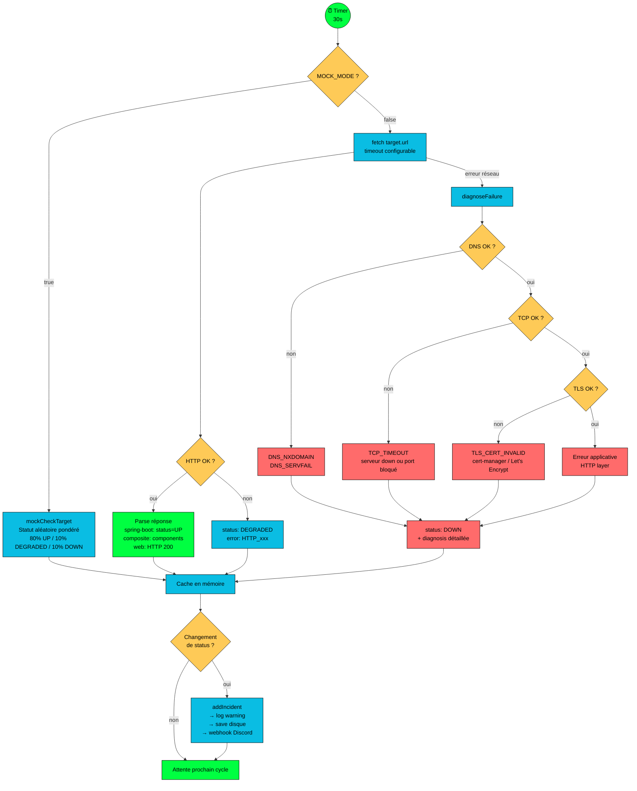
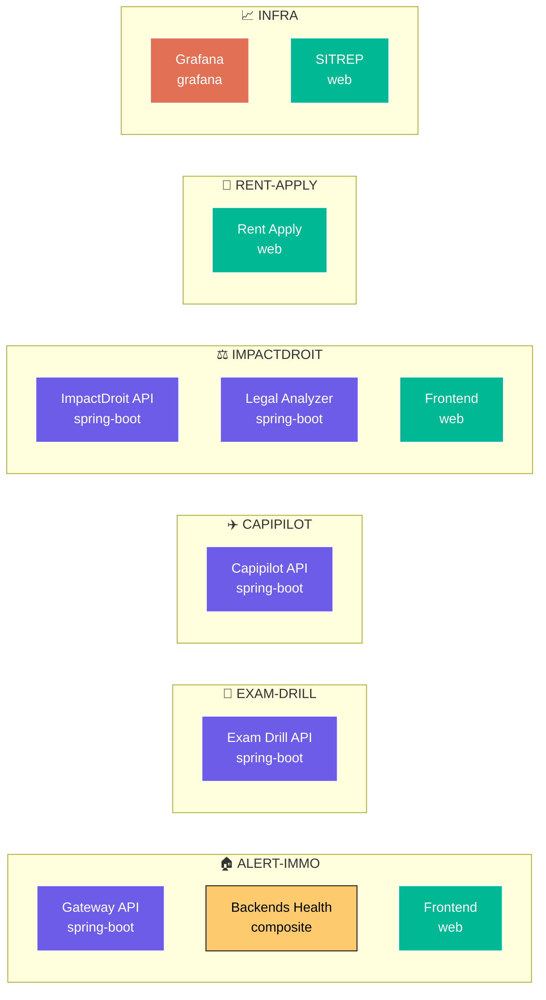
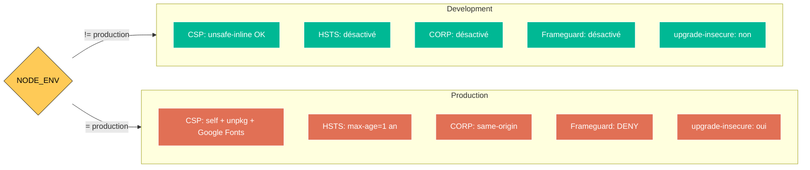

# 🎯 SITREP — Mini-Cours Carré

> **SITuation REPort** — Tableau de bord tactique de monitoring temps réel.
> Surveille la santé de toutes les apps de production, alerte sur Discord, et trace les incidents.

---

## 📐 Architecture Générale

```mermaid
flowchart TB
    subgraph CLIENTS["🖥️ Navigateur"]
        UI["index.html\nDashboard principal"]
        ADMIN["admin.html\nDashboard business"]
        INFRA["infra.html\nGraphe d'infra"]
    end

    subgraph SERVER["⚙️ server.js — Express"]
        direction TB
        HELMET["🛡️ Helmet\nHeaders sécurité"]
        RATE["⏱️ Rate Limiter\n60 req/min API"]
        PINO["📝 Pino Logger\nJSON structuré"]

        subgraph CORE["Moteur de Polling"]
            POLL["pollAll\ntoutes les 30s"]
            CHECK["checkTarget\nHTTP + diagnostic"]
            DIAG["diagnoseFailure\nDNS → TCP → TLS"]
            MOCK["mockCheckTarget\nMode simulé"]
        end

        subgraph CERTS["Certificats SSL"]
            CERTPOLL["pollCerts\ntoutes les 6h"]
            CERTCHECK["checkCert\nTLS handshake"]
        end

        subgraph API["API REST"]
            STATUS["/api/status"]
            INCIDENTS["/api/incidents"]
            APPS_EP["/api/apps"]
            PROXY["/api/apps/:id/dashboard/:ep"]
            HEALTH["/api/apps/:id/health"]
            IGRAPH["/api/infra-graph"]
            DBMET["/api/database-metrics"]
        end

        subgraph OPS["Observabilité"]
            HEALTHZ["/healthz"]
            READYZ["/readyz"]
            METRICS["/metrics\nPrometheus"]
        end
    end

    subgraph STORAGE["💾 Persistance"]
        CACHE["Map en mémoire\nstatus + latence"]
        HISTORY["latencyHistory\n30 derniers points"]
        UPTIME["uptimeChecks\nratio UP/total"]
        DISK["data/incidents.json\nfichier local"]
    end

    subgraph TARGETS["🎯 Cibles Surveillées"]
        AI["🏠 Alert-Immo\nGateway + System + Frontend"]
        ED["📝 Exam-Drill\nSpring Boot API"]
        CP["✈️ Capipilot\nSpring Boot API"]
        ID["⚖️ ImpactDroit\nAPI + Analyzer + Frontend"]
        RA["🏢 Rent-Apply\nFrontend Vercel"]
        INF["📈 Grafana + SITREP"]
    end

    subgraph ALERTS["🔔 Alertes"]
        DISCORD["Discord Webhook\nEmbeds colorés"]
    end

    CLIENTS -->|"fetch JSON"| API
    CLIENTS -->|"GET /"| SERVER
    POLL -->|"real"| CHECK
    POLL -->|"mock"| MOCK
    CHECK -->|"échec"| DIAG
    CHECK --> CACHE
    CHECK --> HISTORY
    CHECK --> UPTIME
    POLL -->|"transition status"| DISK
    POLL -->|"transition status"| DISCORD
    CERTPOLL --> CERTCHECK
    CERTCHECK -->|"expiry < 14j"| DISCORD
    CHECK --> AI & ED & CP & ID & RA & INF
    PROXY -->|"fetch backend"| AI

    classDef client fill:#1a1a2e,stroke:#00ff41,color:#e0e0e0
    classDef server fill:#16213e,stroke:#0abde3,color:#e0e0e0
    classDef storage fill:#1a1a2e,stroke:#feca57,color:#e0e0e0
    classDef target fill:#0d1117,stroke:#ff6b6b,color:#e0e0e0
    classDef alert fill:#1a1a2e,stroke:#ff9ff3,color:#e0e0e0

    class UI,ADMIN,INFRA client
    class HELMET,RATE,PINO,POLL,CHECK,DIAG,MOCK,CERTPOLL,CERTCHECK server
    class STATUS,INCIDENTS,APPS_EP,PROXY,HEALTH,IGRAPH,DBMET server
    class HEALTHZ,READYZ,METRICS server
    class CACHE,HISTORY,UPTIME,DISK storage
    class AI,ED,CP,ID,RA,INF target
    class DISCORD alert
```



---

## 📁 Structure des Fichiers

```
sitrep/
├── server.js              ← Serveur Express principal (850 lignes)
├── config.js              ← Registre des cibles et apps (231 lignes)
├── lib/
│   ├── logger.js          ← Logger structuré Pino
│   ├── mock.js            ← Faux health checks pour dev local
│   └── persistence.js     ← Sauvegarde incidents sur disque
├── public/
│   ├── index.html         ← Dashboard principal
│   ├── admin.html         ← Dashboard business multi-app
│   ├── infra.html         ← Graphe d'infrastructure (Cytoscape.js)
│   ├── app.js             ← JS frontend dashboard
│   ├── admin-app.js       ← JS frontend admin
│   └── style.css          ← Styles communs
├── docker-compose.dev.yml ← Stack dev locale one-click
├── Dockerfile             ← Image prod (Node 20 Alpine)
├── .env.example           ← Variables d'environnement documentées
└── package.json           ← v2.1.0
```

---

## 🔄 Cycle de Vie d'un Health Check



---

## 🚀 Démarrage Rapide

### En local (sans infra)

```bash
# 1. Installer les dépendances
npm install

# 2. Lancer en mode mock (aucune cible réelle contactée)
npm run dev:mock
# → http://localhost:3333

# 3. Ou avec docker-compose
docker compose -f docker-compose.dev.yml up --build
```

### En production

```bash
# Variables obligatoires
export DISCORD_WEBHOOK_URL="https://discord.com/api/webhooks/..."
export NODE_ENV=production

# Optionnel : cibles externes (K8s ConfigMap)
export SITREP_TARGETS_FILE=/etc/sitrep/targets.json

node server.js
```

---

## ⚙️ Variables d'Environnement

| Variable | Défaut | Description |
|----------|--------|-------------|
| `PORT` | `3333` | Port d'écoute HTTP |
| `NODE_ENV` | — | `production` active HSTS, CORP, logging JSON |
| `MOCK_MODE` | `false` | `true` = health checks simulés, zéro appel réseau |
| `POLL_INTERVAL` | `30000` | Intervalle de polling en ms |
| `DISCORD_WEBHOOK_URL` | — | URL webhook Discord pour alertes |
| `CERT_EXPIRY_ALERT_DAYS` | `14` | Seuil d'alerte expiration SSL (jours) |
| `LOG_LEVEL` | `debug`/`info` | `debug` en dev, `info` en prod |
| `PROMETHEUS_URL` | — | URL Prometheus pour métriques DB |
| `SITREP_TARGETS_FILE` | — | Fichier JSON externe pour cibles |
| `SITREP_APPS_FILE` | — | Fichier JSON externe pour apps |

---

## 📡 API Reference

### Santé & Observabilité

| Endpoint | Méthode | Rate Limit | Description |
|----------|---------|------------|-------------|
| `/healthz` | GET | aucun | Liveness probe → `{"status":"ok"}` |
| `/readyz` | GET | aucun | Readiness probe → 503 jusqu'au 1er poll terminé |
| `/metrics` | GET | aucun | Métriques Prometheus (text/plain) |

### Données de Monitoring

| Endpoint | Méthode | Description |
|----------|---------|-------------|
| `/api/status` | GET | Statut de toutes les cibles + summary |
| `/api/status/refresh` | POST | Force un poll immédiat (5 req/min max) |
| `/api/incidents` | GET | Liste des incidents (transitions de statut) |
| `/api/infra-graph` | GET | Graphe d'infra (nodes + edges Cytoscape.js) |
| `/api/database-metrics` | GET | Métriques d'isolation DB + decision matrix |

### Multi-App Dashboard

| Endpoint | Méthode | Description |
|----------|---------|-------------|
| `/api/apps` | GET | Liste des apps enregistrées |
| `/api/apps/:appId/health` | GET | Santé des cibles d'une app |
| `/api/apps/:appId/dashboard/:ep` | GET | Proxy vers le backend métier (cache 10s) |
| `/api/apps/:appId/ademe` | GET | Proxy ADEME stats+health (cache 15s) |

---

## 🎯 Cibles Surveillées (config.js)



### Types de Cibles

| Type | Détection UP | Détection DOWN |
|------|-------------|----------------|
| `spring-boot` | JSON `{ status: "UP" }` | HTTP non-200 ou timeout |
| `composite` | JSON `{ status: "UP", components: {...} }` | Agrège les sous-composants |
| `web` | HTTP 200 | HTTP non-200 ou timeout |
| `grafana` | HTTP 200 | HTTP non-200 ou timeout |

---

## 🧱 Modules Internes

### `lib/logger.js` — Logging Structuré

```
Dev  → JSON lisible sur stdout (level: debug)
Prod → JSON pur pour Loki/Grafana (level: info)
```

**Usage :**
```javascript
const log = require("./lib/logger");
log.info({ target: "capipilot-api", latency: 42 }, "health check OK");
log.warn({ daysLeft: 3, hostname: "api.example.com" }, "SSL cert expiring");
log.error({ err: err.message }, "Discord webhook failed");
```

### `lib/mock.js` — Mode Simulation

Remplace les vrais appels HTTP par des réponses simulées :
- **Pondération réaliste** : 80% UP, 10% DEGRADED, 10% DOWN
- **État sticky** : chaque cible garde son statut 2-5 cycles avant de changer
- **Latences réalistes** : UP=20-100ms, DEGRADED=200-1000ms, DOWN=3-8s
- **Diagnostic mockée** : les cibles DOWN incluent un faux diagnostic TCP_TIMEOUT

### `lib/persistence.js` — Incidents sur Disque

- Charge `data/incidents.json` au démarrage
- Sauvegarde debounced (2s) après chaque transition
- Sauvegarde synchrone sur SIGTERM/SIGINT (graceful shutdown)
- Auto-création du dossier `data/`
- Max 200 incidents (FIFO)

---

## 🛡️ Sécurité (Helmet)



> ⚠️ **Piège Safari** : HSTS sur HTTP localhost empoisonne le cache → Safari upgrade tous les sous-fichiers en HTTPS → CSS/JS cassé. C'est pour ça que HSTS est désactivé en dev.

---

## 🔔 Alertes Discord

Deux types d'alertes sont envoyées automatiquement :

### 1. Transitions de Statut

| Transition | Couleur | Emoji |
|-----------|---------|-------|
| → DOWN | Rouge `#ff3333` | 🔴 |
| → DEGRADED | Orange `#ffaa00` | 🟡 |
| → OPERATIONAL | Vert `#00ff41` | 🟢 |

### 2. Expiration SSL

| Jours restants | Comportement |
|----------------|-------------|
| ≤ 14 jours | Alerte ⚠️ |
| ≤ 7 jours | Alerte ⚠️ orange |
| ≤ 3 jours | Alerte 🚨 rouge + `@here` |
| ≤ 1 jour | Alerte 🚨 critique |

Les alertes sont dédupliquées par bracket (14/7/3/1) pour éviter le spam toutes les 6h.

---

## 🐳 Docker

### Image de Production

```dockerfile
FROM node:20-alpine    # Image minimale
WORKDIR /app
ENV NODE_ENV=production
COPY package*.json ./
RUN npm ci --omit=dev  # Pas de devDependencies
COPY . .
EXPOSE 3333
USER node              # Non-root
CMD ["node", "server.js"]
```

### Stack Dev Locale

```bash
docker compose -f docker-compose.dev.yml up --build
```

Contient :
- SITREP en mode mock (POLL_INTERVAL=5s)
- 3 faux targets nginx (pour tester sans mock)
- Volume persistant pour les incidents

---

## 📊 Métriques Prometheus

Le endpoint `/metrics` expose :

```
sitrep_target_status{target="capipilot-api",group="CAPIPILOT"} 1
sitrep_target_latency_ms{target="capipilot-api",group="CAPIPILOT"} 42
sitrep_target_uptime_ratio{target="capipilot-api",group="CAPIPILOT"} 0.9985
sitrep_incidents_total 12
sitrep_poll_interval_seconds 30
sitrep_mock_mode 0
```

Intégrable directement dans Grafana via un job Prometheus :
```yaml
- job_name: sitrep
  static_configs:
    - targets: ["sitrep:3333"]
  metrics_path: /metrics
```

---

## 🧪 Scripts npm

| Commande | Description |
|----------|-------------|
| `npm start` | Démarrage production |
| `npm run dev` | Dev avec hot-reload (`--watch`) |
| `npm run dev:mock` | Dev mock (MOCK_MODE=true, poll 5s, hot-reload) |

---

## 🔧 Étendre la Configuration

### Ajouter une nouvelle cible

Dans `config.js` (section TARGETS) :

```javascript
{
  id: "mon-service-api",       // Unique ID
  name: "Mon Service API",     // Nom affiché
  group: "MON-SERVICE",        // Groupe (pour regroupement dashboard)
  type: "spring-boot",         // spring-boot | web | composite | grafana
  icon: "🚀",                 // Emoji affiché
  url: "https://api.example.com/actuator/health",
  timeout: 10000,              // Timeout en ms
}
```

Ou via fichier externe (`SITREP_TARGETS_FILE=targets.json`) pour éviter de toucher au code.

### Ajouter une nouvelle app (dashboard business)

Dans `config.js` (section APPS) :

```javascript
{
  id: "mon-app",
  name: "Mon App",
  icon: "🚀",
  group: "MON-SERVICE",            // Doit matcher un groupe de targets
  description: "Description courte",
  backendUrl: "https://api.example.com",
  dashboard: {
    endpoints: ["overview", "stats"],  // Endpoints proxifiés
    ademe: false,                      // Intégration ADEME ?
    widgets: ["kpis", "stats"],        // Widgets à afficher
  },
}
```

---

## 💡 Concepts Clés à Retenir

1. **Polling actif** — SITREP appelle les cibles, il ne reçoit pas de push
2. **Diagnostic multi-couche** — Quand un check échoue : DNS → TCP → TLS → HTTP pour identifier la cause exacte
3. **Status transitions** — Les incidents ne sont créés que lors d'un *changement* de statut (pas à chaque check DOWN)
4. **Proxy dashboard** — SITREP sert de passerelle vers les backends métier (cache 10-15s, pas d'exposition directe)
5. **Mock mode** — Tout le dashboard fonctionne sans réseau, parfait pour développer les vues
6. **Anti-ClickOps** — Toute la config peut être externalisée en JSON (ConfigMap K8s, volume Docker)

---

*SITREP v2.1.0 — dernière mise à jour : mars 2026*
